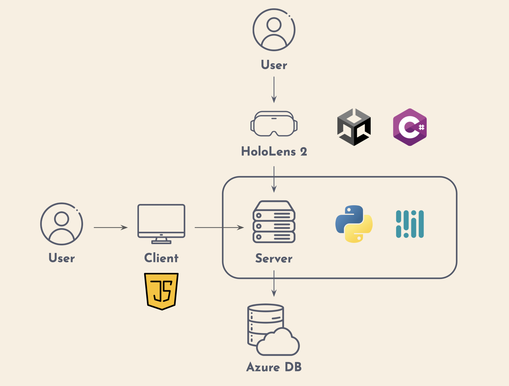

# SignLens: Sign Language and Speech Recognition System Using HoloLens 2

## Description

In Taiwan, approximately 10.5% of disabled individuals have hearing impairments, with 44% facing significant communication challenges in daily life. The limited popularity of sign language and the scarcity of sign language interpreters further exacerbate these challenges. SignLens aims to bridge this communication gap through a cutting-edge sign language translation system, designed to enhance the interaction between the hearing-impaired and the general public.

## Objective

Our objective was to create a sign language translation system to improve communication efficiency between the hearing-impaired and the general public, leveraging the capabilities of Microsoft's HoloLens 2.

## System Architecture

## Demo

## Approach

### User Insight Gathering

Through interviews with hearing-impaired individuals and sign language interpreters, we identified key challenges in current communication methods:
- Lack of emotional nuance in text-based communication.
- The inconvenience of web-based sign language translation tools.
- The absence of sign language interpretation in critical contexts like banks and hospitals.

### Technology Research

After evaluating various machine learning methodologies, we chose the Recurrent Neural Network (RNN), specifically the Gated Recurrent Unit (GRU) model, for its proficiency in processing sequential data and suitability for real-time applications.

### Model Development and MR Integration

We successfully developed a GRU-based model and integrated it with the HoloLens 2 mixed-reality headset. This allows users to see sign language interpretation subtitles and facial expressions in real time, enhancing the system's interactivity, mobility, and convenience.

## Results

Our system translates sign language video clips and audio into subtitles with the following accuracy rates:
- Training accuracy: 97.4%
- Testing accuracy: 90.2%
- Real-world testing accuracy: 85%

This project has won first place in the International ICT Innovative Services Awards 2022 and the departmental IS project competition, demonstrating its innovation and scalability.

## How to Use
Using Unity 2020.3 LTS
The whole project contains 2 Unity Projects
SLR (Sign Language Recognition)
SR  (Speech Recognition)
The Scene is in UX/Dialog Folder
Be sure to import the Azure Spatial Anchor SDK and tgz file in Unity project
## Contributing

We welcome contributions from the community. Please refer to our contributing guidelines for more information on how to get involved.

## Acknowledgments

We thank all the individuals and organizations that supported this project, especially those from the hearing-impaired community who shared their experiences and challenges with us.

